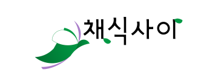

  

<h1 align="center">채식 사이</h1>

채식주의자를 위한 가공 식품 원재료 분석
어플리케이션

# 사용 언어, 프레임워크
Javascript, [ReactNative](https://github.com/facebook/react-native), [Expo](https://github.com/expo/expo), [Redux](https://github.com/reduxjs/redux)

# 구조

## Block Diagram

  

## Application
[Block Diagram]에서 User가 카메라로 사진을 찍거나 기존 이미지를 어플리케이션에 등록한다. 처음으로 [사용자 정보 입력 모듈]을 통해 채식주의자 종류를 선택한다. 기존 사용자의 경우 [인증 모듈]을 통해 사용자를 인증 한 뒤, [사용자 정보 호출 모듈]을 통해 자신의 기존 활동 이력이나, 정보를 불러온다. 이후 어플리케이션에서 사용자가 이미지를 등록하거나 사진을 찍어서 업로드를 진행하면 Naver OCR API를 통해 텍스트 값을 받아온 뒤 [API Server]로 전송한다

# 페이지 구성
- regist
    - preview
    - name, password
    - vegan kind
    - finish
- manual
    - preview
    - first
    - second
    - finish
- main
    - camera
    - product detail

# 폴더 구조
- assets
    - fonts
    - images
- components
    - styledCompnents
- constants
- hooks
- navigation
- reducers
- screens

# 사용 api

- ### [NAVER OCR](https://www.ncloud.com/product/aiService/ocr)